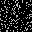

# Noise-image-Recovery
CNN encoder and decoder for noise image recovery in Pytorch
- model 
  

- `generate noise`

  ```python
  def gen_noise_img(self,image,noise_percent):
      img = copy.deepcopy(image)
      height, width = img.shape[:2]
      real_num= int(width*(1-noise_percent)) # true pixel number
      for i in range(0,height): # every row
          for k in range(0, 3):  # every channel 
              mask = np.zeros(width)
              mask[:real_num] = 1
              random.shuffle(mask)
              for j in range(0,width): # col
                      img[i][j][k] *=mask[j]
  ```
## Results


### CIFAR10：

Noise Image - Recover Image  - Original Image （epoch40）：

- 80% noise




- 40% noise


- 60% noise


### A（80% noise）：

<figure class="half">
  
  
</figure>

- Change process：

<figure class="half">

</figure>

Epoch = 1 -> Epoch = 6

<figure class="half">

</figure>

Epoch = 11 -> Epoch = 40


### B（40% noise）：

<figure class="half">

</figure>

### C（60% noise）：

<figure class="half">

</figure>

